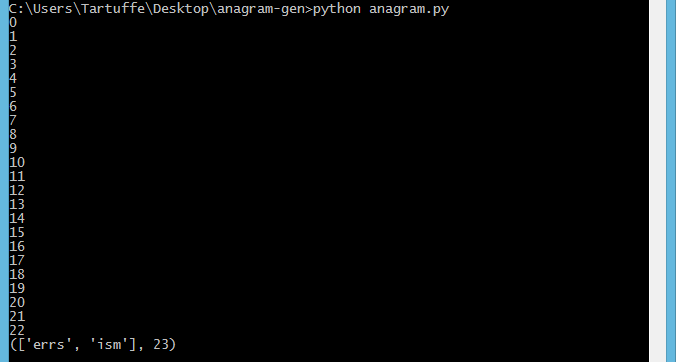

# anagram-gen

##### A basic anagram generator.

### 7/13/2017: First commit

##### The first success came with printing an array of different numbers, each one a value given to a character from the input. Currently, the program will accept more than just letters in the English alphabet. The training wheels are still very much on.

```python
def anagram(name):
    s = name    # converts input to string
    b = len(s)  # b for blank spaces
    a = []      # array to be filled by rearranged letters
    
    for i in range(b):
        a.append(i)

    return(a)
print(anagram("tartuffe"))
```

### 7/15/2017: A successful scramble

##### My last problem, as it turns out, came from failing to consider random.shuffle() when reading through the Python documentation on pseudo-random numbers. When I incorporated that function, the letters started scrambling.

```python
def char_array(name):
    s = name                # converts input to string
    b = len(s)              # b for blank spaces                        
    a = [c for c in s]      # array to be filled by rearranged letters 
    random.shuffle(a)       # mix up array letters
    return "".join(a)       # generate results as a string
```

##### Using this newfound knowledge, I succeded in taking [someone else's ideas](https://rosettacode.org/wiki/Anagrams#Python) and writing a function that not only scrambles individual words, but references them with other real words to create meaning.

```python
def new_anagram(sentence):
    l = sentence.split() # new list
    nl = []
    for w in l:
        ana = anagram(w) # calls function that scrambles one word
        if ana:
            choice = random.choice(anagram(w))
            nl.append(choice)
        else:
            nl.append(w)
    return " ".join(nl)

print(new_anagram("erasmus tied cartesian silt citrus"))
```

### 8/22/2017: Two words!



##### Well, one of them is technically a suffix, but this is the first instance in testing in which two "words" appeared. This must be random and highly unlikely with the algorithm used.

